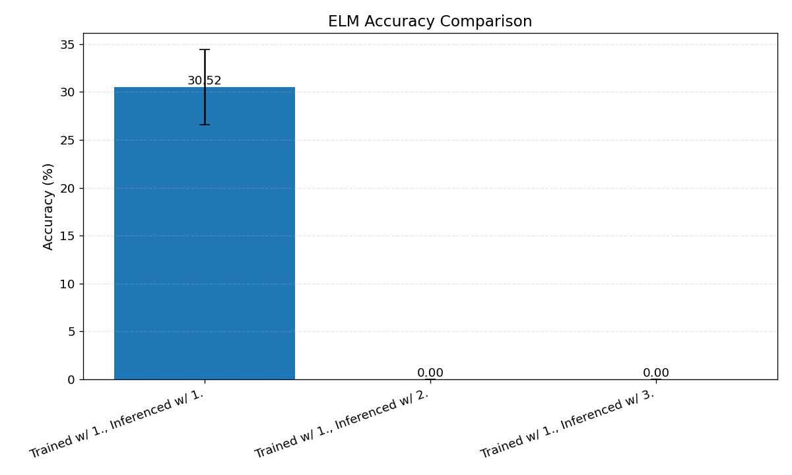
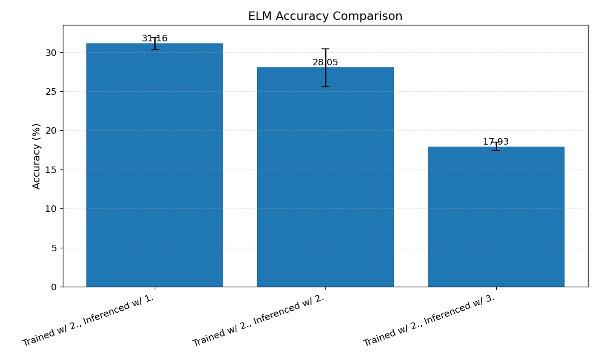
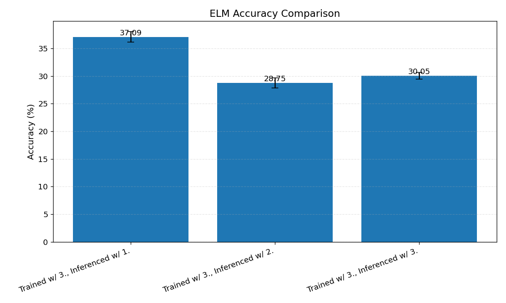

<h2 align="center">
  A Unified Framework for Benchmarking Generative Electrocardiogram-Language Models (ELMs)
</h2>

[](https://doi.org/10.5281/zenodo.15299517)

<div align="center">
  
</div>

## News

- **[October 18, 2025]** We have released [preprocessed ECG files](https://drive.google.com/drive/folders/1HVpLS93Sq_jyRGlcE2Zt-t9f45_ilREd?usp=sharing), such that you do not have to do the preprocessing yourself.
- **[October 16, 2025]** We have finished the refactor, for new and old users, please refer to the documentation below and the [brief release notes](https://github.com/willxxy/ECG-Bench/releases/tag/0.0.5).
- **[October 3, 2025]** We are currently going under a big refactor for easier use of the repository. We thank you for your patience and will update once its done!
- **[October 3, 2025]** We have released our paper [Retrieval-Augmented Generation for Electrocardiogram-Language Models](https://arxiv.org/abs/2510.00261). There is currently a [pull request](https://github.com/willxxy/ECG-Bench/pull/3) for the updated integration of RAG utilized with ELMs in the paper. Feel free to check it out.
- **[August 5, 2025]** We released official splits of ELM datasets on Hugging Face. Feel free to check them out [here](#hugging-face-dataset-5-fold-stratified-splits)!
- **[May 24, 2025]** We release our paper ["Signal, Image, or Symbolic: Exploring the Best Input Representation for Electrocardiogram-Language Models Through a Unified Framework"](https://arxiv.org/abs/2505.18847) with some interesting results when comparing input representations and training paradigms for ELMs! Check it out.
- **[April 5, 2025]** We open source ECG-Bench for training and evaluating ELMs!

## Table of Contents
1. [Overview](#overview)
2. [Installation](#installation)
3. [ECG Datasets](#data)
4. [Main Methods](#methods)
5. [Known Issues + Tips](#issues)
6. [Contributions](#contributions)
7. [TODO](#todo)
8. [Acknowledgements](#ack)
9. [License](#license)
10. [Citations](#citations)


## Overview <a name="overview"></a>
This repository is a unified framework for training and evaluating electrocardiogram-language models (ELMs). The audience for this repository is mainly for researchers who are interested in developing ELMs, with a particular focus on ECG representations and training paradigms. The code is designed to be modular and flexible, allowing researchers to easily extend the framework to their own needs and quickly iterate on their ELM designs. Due to the intended audience and purpose of the repository, we try to provide the most basic and flexible code without many abstractions that can be easily extended. However, this goal is yet to be fully realized and we are continuously working to improve the codebase. Please note that as the codebase gets updated, performances may change.

We hope to continuously update the repository to support more features, ELMs, and datasets. Please feel free to contribute to the repository!
If there are any questions or bugs, please do not hesitate to reach out to wjhan{@}andrew{dot}cmu{edu} or submit an issue with corresponding details.

### ECG Input Representations
This current repository considers 4 input representations of ECGs as defined below:

**ECG Signal (`--ecg_signal`):**  
The raw ECG signal is represented as a matrix `X_sig` $\in$ `R^(C x L)`, where `C` denotes the number of leads and `L` is the number of time samples per lead. All other modalities are derived from `X_sig`.

**ECG Image (`--ecg_image`):**  
An ECG image is derived from `X_sig` via plotting and is represented as a tensor `X_img` $\in$ `R^(H x W x C′)`, where `H` and `W` denote the image height and width, respectively, and `C′` is the number of color channels.

**Stacked ECG Signal (`--ecg_stacked_signal`):**  
We also create a synthetic three-channel version of `X_sig`, denoted `X_sig*` $\in$ `R^(C x L x 3)`, by stacking `X_sig` three times along the color dimension (as seen in ECG Image).

**ECG Symbol (`--ecg_token`):**  
We use ECG-Byte’s compression schema to convert ECG signals into text. First, a normalized and discretized ECG signal `X_sig` is mapped to a symbolic sequence using a set of symbols `A = {a, b, …, z}`. This sequence is then flattened into a one-dimensional array `X_symb` $\in$ `A^(C * L)`. Finally, a byte-pair encoding (BPE) process compresses `X_symb` into a sequence of tokens from an extended vocabulary `V`, resulting in the final textual representation `X_ID` $\in$ `V^(m)`, where `m` is the length of the token sequence.

### ELMs and Their Components
We implement the following ELMs:

- [ECG-Byte: A Tokenizer for End-to-End Electrocardiogram Language Modeling](https://arxiv.org/abs/2412.14373)
- [LLaVA](https://arxiv.org/abs/2304.08485)-like ELMs (e.g., neural network encoder + projection layer+ LLM)
- Encoder-free ELMs (e.g., projection layer + LLM)

We also provide implementations of the following ECG-specific encoders:

- [Guiding Masked Representation Learning to Capture Spatio-Temporal Relationship of Electrocardiogram](https://arxiv.org/abs/2402.09450)
- [Zero-Shot ECG Classification with Multimodal Learning and Test-time Clinical Knowledge Enhancement](https://arxiv.org/abs/2403.06659)
- [MaeFE: Masked Autoencoders Family of Electrocardiogram for Self-Supervised Pretraining and Transfer Learning](https://ieeexplore.ieee.org/document/9980411)

Utilizing HuggingFace, we also provide general, pretrained models to serve as ECG encoders:

- [ViT](https://arxiv.org/abs/2010.11929)
- [CLIP](https://arxiv.org/abs/2103.00020)
- [SigLIP](https://arxiv.org/abs/2303.15343)

We utilize the HuggingFace API to create wrappers around the following pretrained LLMs:

- [Llama 3](https://arxiv.org/abs/2407.21783)
- [Gemma 2](https://arxiv.org/abs/2408.00118)
- [Qwen 2.5](https://arxiv.org/abs/2412.15115)

We also have [GPT 2](https://cdn.openai.com/better-language-models/language_models_are_unsupervised_multitask_learners.pdf) and [OPT](https://arxiv.org/abs/2205.01068) LLMs, however, we do not have chat tempaltes for them yet.

## Installation <a name="installation"></a>
All installations and experiments were completed on Ubuntu 20.04.5 LTS with NVIDIA A5000 and A6000 GPUs.

1. To install Rust: `curl --proto '=https' --tlsv1.2 -sSf https://sh.rustup.rs | sh -s -- --default-toolchain=1.82.0 -y`

2. Open a new terminal to set PATH for Rust installation.

3. After opening a new terminal, check the Rust installation by running `rustc --version`.

4. Create the conda virtual environment via `conda create -n ecg python=3.10`.

5. Activate the environment `conda activate ecg`

6. Install the `uv` package manager via `pip install uv`.

8. `git clone https://github.com/willxxy/ECG-Bench.git`

9. `cd ECG-Bench`

6. For base installation `uv pip install -e .`

7. For installation with flash attention `uv pip install -e ".[flash]" --no-build-isolation`

8. For installation with judge `uv pip install -e ".[judge]"`

9. For installation of all packages `uv pip install -e ".[all]" --no-build-isolation`

10. Optionally, run `pre-commit install` to install the pre-commit hooks.

11. `cd` into `ECG-Bench/ecg_bench/ecg_tokenizers/ecg_byte` and execute `maturin develop --release` to compile the ECG-Byte tokenizer.

12. Run all the tests by executing `bash scripts/run_tests.sh`.

13. Another consideration is that we use ***gated*** models (e.g., Llama 3.2, Gemma) from HuggingFace, therefore you will need to get an api key and export the environment variable `export HF_TOKEN=$API_KEY`.

**NOTE: The working directory is the root (`ECG-Bench`) directory of the repository.**

## ECG Datasets <a name="data"></a>
We also provide preprocessing pipelines for various datasets in this repository.
**Note that one can skip the entire preprocessing section by downloading our [preprocessed ECG files](https://drive.google.com/drive/folders/1HVpLS93Sq_jyRGlcE2Zt-t9f45_ilREd?usp=sharing) and skip to the main methods section.**
We provide preprocessed ECGs at 2, 5, and 10 second recordings sampled at 250 Hz.
The structure in which the `data` folder should be in is the following:

```
ECG-Bench
└── ecg_bench
    └── data
        ├── csn
        │   ├── preprocessed_1250_250
        │   ├── preprocessed_500_250
        │   └── preprocessed_2500_250
        ├── cpsc
        │   └── ...
        ├── ptb
        │   └── ...
        ├── mimic
        │   └── ...
        └── code15
            └── ...
```
where ... denotes the same `preprocessed_1250_250`, `preprocessed_500_250`, `preprocessed_2500_250` folders.
The `.zip` file should unzip the data name folder and the corresponding preprocessed folders already.

**Datasets:**

1. [PTB-XL, a large publicly available electrocardiography dataset](https://physionet.org/content/ptb-xl/1.0.0/)
2. [MIMIC-IV-ECG: Diagnostic Electrocardiogram Matched Subset](https://physionet.org/content/mimic-iv-ecg/1.0/)
3. [CODE-15%: a large scale annotated dataset of 12-lead ECGs](https://zenodo.org/records/4916206)
4. [CPSC from Classification of 12-lead ECGs: The PhysioNet/Computing in Cardiology Challenge 2020](https://physionet.org/content/challenge-2020/1.0.2/training/cpsc_2018/#files-panel)
5. [CSN from A large scale 12-lead electrocardiogram database for arrhythmia study](https://physionet.org/content/ecg-arrhythmia/1.0.0/)
6. [MIMIC-IV and PTB-XL variants of ECG-QA: A Comprehensive Question Answering Dataset Combined With Electrocardiogram](https://arxiv.org/abs/2306.15681)
7. [Pretrain MIMIC-IV and ECG Instruct 45K from ECG-Chat: A Large ECG-Language Model for Cardiac Disease Diagnosis](https://arxiv.org/abs/2408.08849)
8. [ECG Instruct Pulse and ECG Bench Pulse from Teach Multimodal LLMs to Comprehend Electrocardiographic Images](https://arxiv.org/abs/2410.19008)
9. [ECG Grounding Datasets from GEM: Empowering MLLM for Grounded ECG Understanding with Time Series and Images](https://www.arxiv.org/abs/2503.06073)

### Hugging Face Dataset 5-Fold Stratified Splits

On Hugging Face, we provide 5-fold datasets stratified by patient, with zero patient overlap between training and testing splits.
We have released the following so far:

**250 Hz Sampling Rate**

| Dataset | 2s | 5s | 10s |
|---------|----|----|-----|
| ECG-QA PTB-XL | [URL](https://huggingface.co/datasets/willxxy/ecg-qa-ptbxl-250-500) | [URL](https://huggingface.co/datasets/willxxy/ecg-qa-ptbxl-250-1250) | [URL](https://huggingface.co/datasets/willxxy/ecg-qa-ptbxl-250-2500) |
| ECG-QA MIMIC-IV-ECG | [URL](https://huggingface.co/datasets/willxxy/ecg-qa-mimic-iv-ecg-250-500) | [URL](https://huggingface.co/datasets/willxxy/ecg-qa-mimic-iv-ecg-250-1250) | [URL](https://huggingface.co/datasets/willxxy/ecg-qa-mimic-iv-ecg-250-2500) |
| Pretrain MIMIC | [URL](https://huggingface.co/datasets/willxxy/pretrain-mimic-250-500) | [URL](https://huggingface.co/datasets/willxxy/pretrain-mimic-250-1250) | [URL](https://huggingface.co/datasets/willxxy/pretrain-mimic-250-2500) |
| ECG Instruct 45K | [URL](https://huggingface.co/datasets/willxxy/ecg-instruct-45k-250-500) | [URL](https://huggingface.co/datasets/willxxy/ecg-instruct-45k-250-1250) | [URL](https://huggingface.co/datasets/willxxy/ecg-instruct-45k-250-2500) |
| ECG Bench Pulse | [URL](https://huggingface.co/datasets/willxxy/ecg-bench-pulse-250-500) | [URL](https://huggingface.co/datasets/willxxy/ecg-bench-pulse-250-1250) | [URL](https://huggingface.co/datasets/willxxy/ecg-bench-pulse-250-2500) |
| ECG Instruct Pulse | [URL](https://huggingface.co/datasets/willxxy/ecg-instruct-pulse-250-500) | [URL](https://huggingface.co/datasets/willxxy/ecg-instruct-pulse-250-1250) | [URL](https://huggingface.co/datasets/willxxy/ecg-instruct-pulse-250-2500) |


We encourage researchers to use these splits to ensure fair baselines. Note that you will still have to download and preprocess the datasets, thus we recommend using the preprocessing pipeline below.

### Base Datasets

We regard base datasets as datasets that are solely used for later mapping of external datasets.

#### PTB-XL

1. Please download the PTB-XL dataset through this [link](https://physionet.org/static/published-projects/ptb-xl/ptb-xl-a-large-publicly-available-electrocardiography-dataset-1.0.3.zip).

2. Please create a `data` folder, unzip the zip file inside the `data` folder and rename the folder as `ptb`.

#### MIMIC

1. Please download the Mimic IV ECG dataset through this [link](https://physionet.org/static/published-projects/mimic-iv-ecg/mimic-iv-ecg-diagnostic-electrocardiogram-matched-subset-1.0.zip).

2. Unzip the zip file inside the `data` directory and rename the unzipped directory as `mimic`.

#### Code-15

1. First create a `code15` folder inside the `data` directory.

2. Then inside `data/code15` execute the following bash script to download the data and unzip it:

```
#!/bin/bash

for i in {0..17}; do
    echo "Downloading part ${i}..."
    wget -O "exams_part${i}.zip" "https://zenodo.org/records/4916206/files/exams_part${i}.zip?download=1"
    
    if [ $? -eq 0 ]; then
        echo "Successfully downloaded part ${i}"
        
        echo "Extracting part ${i}..."
        unzip -q "exams_part${i}.zip"
        
        if [ $? -eq 0 ]; then
            echo "Successfully extracted part ${i}"
            rm "exams_part${i}.zip"
        else
            echo "Error extracting part ${i}"
        fi
    else
        echo "Error downloading part ${i}"
    fi
done

echo "All downloads and extractions completed"
```

#### CSN

1. Create a `csn` folder inside the `data` directory.

2. Inside `data/csn` execute the following command in the terminal:

```
wget https://physionet.org/static/published-projects/ecg-arrhythmia/a-large-scale-12-lead-electrocardiogram-database-for-arrhythmia-study-1.0.0.zip
```

3. Unzip the file and inside of `data/csn/a-large-scale-12-lead-electrocardiogram-database-for-arrhythmia-study-1.0.0` move all of the contents outside to `data/csn`. Then you may delete the `a-large-scale-12-lead-electrocardiogram-database-for-arrhythmia-study-1.0.0` folder.

#### CPSC

1. Create a `cpsc` folder inside the `data` directory.

2. Inside `data/cpsc` execute the following command in the terminal:

```
wget https://physionet.org/static/published-projects/challenge-2020/classification-of-12-lead-ecgs-the-physionetcomputing-in-cardiology-challenge-2020-1.0.2.zip
```

3. Unzip the file and inside of `data/cpsc/classification-of-12-lead-ecgs-the-physionetcomputing-in-cardiology-challenge-2020-1.0.2/training` move the `cpsc_2018` and `cpsc_2018_extra` folders into the `data/cpsc` directory. Then delete the `classification-of-12-lead-ecgs-the-physionetcomputing-in-cardiology-challenge-2020-1.0.2` folder.

### Preprocessing

1. Execute the preprocessing script by `bash scripts/preprocess.sh`. We have provided default configurations for all the datasets used in our study but feel free to experiment with others!

## Main Methods <a name="methods"></a>

We simplify the categorization of ELMs not by their training procedure but their architecture.
Simply run with the corresponding flags for the desired ELM (e.g., `--encoder=$ENCODER, --llm=$LLM`) and ECG representation (e.g., `--ecg_signal, --ecg_image, --ecg_stacked_signal, --ecg_token`).

Note that specific ELMs may require specific ECG representations as seen in the `assert_data_model_match()` function in `ecg_bench/dataloaders/build_dataloader.py`.

We provide examples in the `scripts` directory.

## Known Issues + Tips <a name="issues"></a>

We encountered some issues during development of ECG-Bench (mostly taken from [ECG-Byte](https://github.com/willxxy/ECG-Byte)) and hope to contribute to the open source community by reporting them here and adding any tips if possible. If you happen to know a good solution to any of them, please do not hesitate to open an issue or pull request!

1. **`tqdm` bar freezing script with multiprocessing** - We noticed that the tqdm bar freezes sometimes when we put it inside a multiprocessing job (especially during preprocessing). We recommend adding print statements before and after the main operations inside the tqdm loop to ensure the operations are being executed. This is a [thread of the issue](https://github.com/tqdm/tqdm/issues/1160) from the tqdm repository. Please feel free to look at it!

2. **Nan values during preprocessing** - We noticed that the MIMIC-IV ECG dataset has many nan values during preprocessing so we workaround this by skipping them.

3. **Non-determinimsm via CuDNN/cuBLAS despite seeding** - During evaluation, we observed run-to-run variation due to CuDNN/cuBLAS nondeterminism. Certain GPU kernels have nondeterministic implementations unless explicitly told otherwise.
  To reduce this variability, add the deterministic flags below before any model creation:
  
  ```
  torch.backends.cudnn.deterministic = True 
  torch.backends.cudnn.benchmark = False
  torch.use_deterministic_algorithms(True)
  ```
  
  And in the bash launch script, set the cuBLAS workspace variable `export CUBLAS_WORKSPACE_CONFIG=":4096:8"`. 
  
  Note that these settings can slow training/inference and may fall back to less-efficient kernels.

4. **Non-determinism via GPUs** - [Read this.](https://thinkingmachines.ai/blog/defeating-nondeterminism-in-llm-inference/)

5. **ECG-Byte Signal Tokens: Do we train them?** - Marking the newly added ECG tokens in the LLM embedding table as trainable has harmed performance in our tests. 
 Currently, ECG-Byte produces ECG tokens that we concatenate with text tokens; these tokens are added to the tokenizer and initialized in the LLM’s embedding table. In our default setup we apply LoRA and keep the embedding table frozen, so these new token vectors are not updated. We ran preliminary experiments in two settings: 1. full fine-tuning (including the LLM embedding layer with the added ECG tokens), 2. LoRA fine-tuning with only the newly added ECG token rows set as trainable. Both settings performed substantially worse than our baseline (LoRA with the LLM embedding table frozen, including the new ECG tokens). We did not deeply investigate the cause; exploring this is an interesting direction for future work.

6. **Do ELMs actually understand the signal?** - To test whether ELMs coherently use features from the input ECG, we conducted preliminary experiments. TL;DR: ELMs appear not to meaningfully exploit ECG features.
We used an encoder-free ELM as the base model. It consists of a linear projection layer that maps the ECG signal to a latent vector, trained jointly with the LLM using an autoregressive loss. We use the `llama-3.2-1b-instruct` checkpoint for the LLM. We trained and evaluated the model under three conditions:

    <ol type="1">
    <li>Regular ECG signal as input</li>
    <li>A tensor of the same shape as the ECG, filled with zeros</li>
    <li>No signal at all (only text)</li>
    </ol>

    We report the following results on the `willxxy/ecg-qa-ptbxl-250-1250` dataset. 1., 2., 3., are the corresponding three conditions.

    <div align="center">
    
    </div>

    <div align="center">
    
    </div>

    <div align="center">
    
    </div>

    As one can see, we can achieve competitive results with the baseline of training and inferencing with 1 when training with 2. or 3. Although this study is not in depth, we aim to discover why this is happening. If anyone is interested, please feel free to reach out or take the idea!

## Contributions <a name="contributions"></a>

We welcome contributions to the repository! Please feel free to open an issue or pull request for any bugs or features you would like to add. We are always looking for new ECG datasets to benchmark our methods on. If you have any recommendations, please let us know! Also, a good place to start is by looking at the [TODO](#todo) section.

For most processes, we have a `--dev` flag to run in a smaller scale and add some verbosity for debugging. Feel free to add this flag when needed! 

### Contributors

We thank the following people for their contributions to the repository:

- [Atharva Mhaskar](https://www.linkedin.com/in/atharva-mhaskar/)
- [Xiaoyu (Simon) Song](https://www.linkedin.com/in/xiaoyu-song-507b89301/)
- [Tony Chen](https://www.linkedin.com/in/tonychen06/)

## TODO <a name="todo"></a>

This is a list of TODOs for the repository. If you are interested in contributing, please feel free to look at the list and open a PR! We are always looking for ways to add more documentation, examples, tests, and workflows for the codebase. Lastly, general improvements to the codebase are always welcome!

- [ ] Add default chat templates for LLMs without chat templates (e.g., GPT 2, OPT).
- [ ] Add [GEM model](https://www.arxiv.org/abs/2503.06073)
- [ ] Add [ECG-Expert-QA dataset](https://arxiv.org/abs/2502.17475)
- [x] Add [ECG-Grounding Dataset](https://huggingface.co/datasets/LANSG/ECG-Grounding)
- [ ] Provide HuggingFace model card push ability.
- [ ] Provide HuggingFace dataset card push ability.
- [ ] Create an offline demo for ELMs with unified preference collection.
- [x] [Retrieval-Augmented Generation](https://arxiv.org/abs/2005.11401)
- [x] Make RAG searching faster.
- [x] Make training with RAG faster.
- [ ] Add encoder-free VLMs such as [Fuyu-8B](https://www.adept.ai/blog/fuyu-8b), [Vision as LoRA](https://arxiv.org/abs/2503.20680), and/or [Unveiling Encoder-Free Vision-Language Models](https://arxiv.org/abs/2406.11832) for ECGs. This could be extended for all training methods.
    - [x] Naive encoder-free method supported.
- [ ] Add [Sparsely-Gated Mixture-of-Experts ELM](https://arxiv.org/abs/1701.06538)
- [ ] Addition for new input representation: [ECG features](https://proceedings.mlr.press/v225/yu23b.html)
- [ ] Reasoning ability for ELMs (akin to OpenAI o1, Deepseek R1, etc.).
- [ ] Curate higher quality instruction tuning and reasoning datasets for ELMs.
- [ ] Expand upon current naive distributed training setting to include more efficient and explicit distributed training strategies (i.e., data, tensor, context, pipeline, and expert parallelism as noted in [here](https://huggingface.co/spaces/nanotron/ultrascale-playbook?section=5d_parallelism_in_a_nutshell)).
- [x] Add option for data mixing.
- [x] For preprocessing, stratify based on patient, such that no overlapping patients between train and test.
- [x] Add official splits for benchmarking.
    - [x] Upload to huggingface datasets and use huggingface datasets data loading in main.

## Acknowledgements <a name="ack"></a>
This work is done in collaboration with the Mario Lemieux Center for Heart Rhythm Care at Allegheny General Hospital.

We thank Chaojing Duan, Michael A. Rosenberg, Emerson Liu, Ding Zhao, Hyoeun Kang, Wenhao Ding, Haohong Lin, Shiqi Liu, Xiaoyu (Simon) Song, Tony Chen, Atharva Mhaskar, Zhepeng Cen, Yihang Yao, and Dylan Leong for their helpful discussions, feedbacks, and support in developing ECG-Bench.

We thank the authors of [ECG-Byte](https://github.com/willxxy/ECG-Byte), [MERL](https://github.com/cheliu-computation/MERL-ICML2024), [ST-MEM](https://github.com/bakqui/ST-MEM), [ECG-QA](https://github.com/Jwoo5/ecg-qa), [ECG-Chat](https://github.com/YubaoZhao/ECG-Chat), [PULSE](https://github.com/AIMedLab/PULSE), and [GEM](https://github.com/lanxiang1017/GEM) for their code and publicly released datasets.

Lastly, we thank [HuggingFace](https://huggingface.co/) for providing the APIs for the models.

## License <a name="license"></a>

This repository contains code licensed under the MIT License, except for the following `.py` files in the `ecg_bench/models/encoder` directory: `st_mem.py`, `mlae.py`, `mtae.py`. These files are licensed under the Creative Commons Attribution-NonCommercial 4.0 International License. Please view the original license in their [respective repository](https://github.com/bakqui/ST-MEM?tab=License-1-ov-file#readme) for more details.

## Citations <a name="citations"></a>
If this codebase or work has helped you please cite the following:

```
@misc{han2025signalimagesymbolicexploring,
      title={Signal, Image, or Symbolic: Exploring the Best Input Representation for Electrocardiogram-Language Models Through a Unified Framework}, 
      author={William Han and Chaojing Duan and Zhepeng Cen and Yihang Yao and Xiaoyu Song and Atharva Mhaskar and Dylan Leong and Michael A. Rosenberg and Emerson Liu and Ding Zhao},
      year={2025},
      eprint={2505.18847},
      archivePrefix={arXiv},
      primaryClass={cs.AI},
      url={https://arxiv.org/abs/2505.18847}, 
}

@misc{han2024ecgbytetokenizerendtoendgenerative,
      title={ECG-Byte: A Tokenizer for End-to-End Generative Electrocardiogram Language Modeling}, 
      author={William Han and Chaojing Duan and Michael A. Rosenberg and Emerson Liu and Ding Zhao},
      year={2024},
      eprint={2412.14373},
      archivePrefix={arXiv},
      primaryClass={cs.CL},
      url={https://arxiv.org/abs/2412.14373}, 
}

@software{willxxy_2025_15299518,
  author       = {willxxy},
  title        = {willxxy/ECG-Bench: 0.0.2},
  month        = apr,
  year         = 2025,
  publisher    = {Zenodo},
  version      = {0.0.2},
  doi          = {10.5281/zenodo.15299518},
  url          = {https://doi.org/10.5281/zenodo.15299518},
  swhid        = {swh:1:dir:f7d66c050e58e1cee773d062aaac90d59001933c
                   ;origin=https://doi.org/10.5281/zenodo.15299517;vi
                   sit=swh:1:snp:b747c15550c41fac7ecb66f5802fc239911b
                   d2c9;anchor=swh:1:rel:3c046172cae8f0fc9e2cff952897
                   97d670c749f8;path=willxxy-ECG-Bench-898547b
                  },
}
```