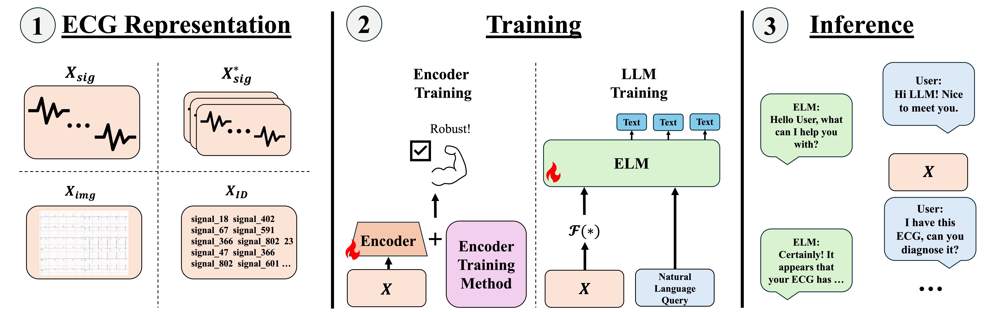

<h2 align="center">
  A Unified Framework for Benchmarking Generative Electrocardiogram-Language Models (ELMs)
</h2>

<div align="center">
  
</div>

## Table of Contents
1. [Overview](#overview)
2. [Installation](#installation)
3. [ECG Datasets](#data)
4. [Main Methods](#methods)
5. [Known Issues + Tips](#issues)
6. [Acknowledgements](#ack)


## Overview <a name="overview"></a>
This repository is a unified framework for training and evaluating electrocardiogram-language models (ELMs). The audience for this repository is mainly for researchers who are interested in developing ELMs. The code is designed to be modular and flexible, allowing researchers to easily extend the framework to their own needs and quickly iterate on their ELM designs. Due to the intended audience and purpose of the repository, we try to provide the most basic and flexible code without many abstractions that can be easily extended. However, this goal is yet to be fully realized and we are continuously working to improve the codebase.

We provide preprocessing pipelines for various datasets in this repository.

**Datasets:**

1. [PTB-XL, a large publicly available electrocardiography dataset](https://physionet.org/content/ptb-xl/1.0.0/)
2. [MIMIC-IV-ECG: Diagnostic Electrocardiogram Matched Subset](https://physionet.org/content/mimic-iv-ecg/1.0/)
3. [CODE-15%: a large scale annotated dataset of 12-lead ECGs](https://zenodo.org/records/4916206)
4. [CPSC from Classification of 12-lead ECGs: The PhysioNet/Computing in Cardiology Challenge 2020](https://physionet.org/content/challenge-2020/1.0.2/training/cpsc_2018/#files-panel)
5. [CSN from A large scale 12-lead electrocardiogram database for arrhythmia study](https://physionet.org/content/ecg-arrhythmia/1.0.0/)
6. [MIMIC-IV and PTB-XL variants of ECG-QA: A Comprehensive Question Answering Dataset Combined With Electrocardiogram](https://arxiv.org/abs/2306.15681)
7. [Pretrain MIMIC-IV and ECG Instruct 45K from ECG-Chat: A Large ECG-Language Model for Cardiac Disease Diagnosis](https://arxiv.org/abs/2408.08849)
8. [ECG Instruct Pulse and ECG Bench Pulse from Teach Multimodal LLMs to Comprehend Electrocardiographic Images](https://arxiv.org/abs/2410.19008)

We implement the following ELMs:

1. [ECG-Byte: A Tokenizer for End-to-End Electrocardiogram Language Modeling](https://arxiv.org/abs/2412.14373)

We also provide implementations of the following ECG-specific encoders:

1. [Guiding Masked Representation Learning to Capture Spatio-Temporal Relationship of Electrocardiogram](https://arxiv.org/abs/2402.09450)
2. [Zero-Shot ECG Classification with Multimodal Learning and Test-time Clinical Knowledge Enhancement](https://arxiv.org/abs/2403.06659)
3. [MaeFE: Masked Autoencoders Family of Electrocardiogram for Self-Supervised Pretraining and Transfer Learning](https://ieeexplore.ieee.org/document/9980411)

Utilizing HuggingFace, we also provide general, pretrained models to serve as ECG encoders:

1. [ViT](https://arxiv.org/abs/2010.11929)
2. [CLIP](https://arxiv.org/abs/2103.00020)
3. [SigLIP](https://arxiv.org/abs/2303.15343)


We provide the following features for training and evaluating ELMs:
1. Single and distributed training.
2. We impemented an LLM judge with llm-blender and utilized [DPO](https://arxiv.org/abs/2305.18290) for post-training.
3. [Flash Attention 2](https://arxiv.org/abs/2307.08691) for faster training and inference.
4. [Retrieval-Augmented Generation](https://arxiv.org/abs/2005.11401)
5. A demo based on gradio for chatting with your own trained ELM!

We hope to continouously update the repository to support more features, ELMs, and datasets. Please feel free to contribute to the repository!
Please carefully read the below documentations to run the pipeline. If there are any questions or bugs, please do not hesitate to reach out to wjhan{@}andrew{dot}cmu{edu} or submit an issue with corresponding details.

All installations and experiments were completed on Ubuntu 20.04.5 LTS with NVIDIA A5000 and A6000 GPUs.

## Installation <a name="installation"></a>

1. To install Rust: `curl --proto '=https' --tlsv1.2 -sSf https://sh.rustup.rs | sh -s -- --default-toolchain=1.79.0 -y`

2. Open a new terminal to set PATH for Rust installation.

3. After opening a new terminal, check the Rust installation by running `rustc --version`.

4. Create the conda virtual environment via `conda create -n ecg python=3.10.15`.

5. Activate the environment `conda activate ecg`

6. `pip install torch==2.3.1 torchvision==0.18.1 torchaudio==2.3.1 --index-url https://download.pytorch.org/whl/cu121`

7. `git clone https://github.com/willxxy/ECG-Bench.git`

8. `cd ECG-Bench`

9. `git submodule init`

10. `git submodule update`

11. Please `cd` into the `ECG-Bench/transformers` directory and `pip install -e .`.

12. Now `cd ../` and `cd` into the `ECG-Bench/ecg-plot` directory and `pip install -e .`.

13. Now `cd ../` and `pip install -e .`

14. To install [Flash Attention 2](https://arxiv.org/abs/2307.08691) please use the following command:

    `pip cache remove flash_attn`

    `pip install flash-attn==2.7.4.post1 --no-cache-dir`

15. To install the `llm-blender` and `trl[judges]` packages please run the following commands:

    `pip install git+https://github.com/yuchenlin/LLM-Blender.git`

    `pip install trl[judges]`

16. Run the `ECG-Bench/test/test_gpu.py` to ensure you are able to use your GPU.

17. Run the `ECG-Bench/test/test_transformers.py` to ensure you properly installed the `transformers` package.

18. `cd` into `ECG-Bench/ecg_bench/rust_bpe` and execute `maturin develop --release` to compile the tokenizer.

19. Another consideration is that we use ***gated*** models (e.g., Llama 3.2, Gemma) from HuggingFace, therefore you will need to get an api key and log into it via `huggingface-cli login` in the terminal. We also require you to log in inside the main training *.py file via the login function `from huggingface_hub import login`.


**NOTE: From now, all instructions will assume you are working from the `ECG-Bench/ecg_bench` directory.**

## ECG Datasets <a name="data"></a>

### Base Datasets

We regard base datasets as datasets that are solely used for later mapping of external datasets.

#### PTB-XL

1. Please download the PTB-XL dataset through this [link](https://physionet.org/static/published-projects/ptb-xl/ptb-xl-a-large-publicly-available-electrocardiography-dataset-1.0.3.zip).

2. Please create a `data` folder, unzip the zip file inside the `data` folder and rename the folder as `ptb`.

#### MIMIC

1. Please download the Mimic IV ECG dataset through this [link](https://physionet.org/static/published-projects/mimic-iv-ecg/mimic-iv-ecg-diagnostic-electrocardiogram-matched-subset-1.0.zip).

2. Unzip the zip file inside the `data` directory and rename the unzipped directory as `mimic`.

#### Code-15

1. First create a `code15` folder inside the `data` directory.

2. Then inside `data/code15` execute the following bash script to download the data and unzip it:

```
#!/bin/bash

for i in {0..17}; do
    echo "Downloading part ${i}..."
    wget -O "exams_part${i}.zip" "https://zenodo.org/records/4916206/files/exams_part${i}.zip?download=1"
    
    if [ $? -eq 0 ]; then
        echo "Successfully downloaded part ${i}"
        
        echo "Extracting part ${i}..."
        unzip -q "exams_part${i}.zip"
        
        if [ $? -eq 0 ]; then
            echo "Successfully extracted part ${i}"
            rm "exams_part${i}.zip"
        else
            echo "Error extracting part ${i}"
        fi
    else
        echo "Error downloading part ${i}"
    fi
done

echo "All downloads and extractions completed"
```

#### CSN

1. Create a `csn` folder inside the `data` directory.

2. Inside `data/csn` execute the following command in the terminal:

```
wget https://physionet.org/static/published-projects/ecg-arrhythmia/a-large-scale-12-lead-electrocardiogram-database-for-arrhythmia-study-1.0.0.zip
```

3. Unzip the file and inside of `data/csn/a-large-scale-12-lead-electrocardiogram-database-for-arrhythmia-study-1.0.0` move all of the contents outside to `data/csn`. Then you may delete the `a-large-scale-12-lead-electrocardiogram-database-for-arrhythmia-study-1.0.0` folder.

#### CPSC

1. Create a `cpsc` folder inside the `data` directory.

2. Inside `data/cpsc` execute the following command in the terminal:

```
wget https://physionet.org/static/published-projects/challenge-2020/classification-of-12-lead-ecgs-the-physionetcomputing-in-cardiology-challenge-2020-1.0.2.zip
```

3. Unzip the file and inside of `data/cpsc/classification-of-12-lead-ecgs-the-physionetcomputing-in-cardiology-challenge-2020-1.0.2/training` move the `cpsc_2018` and `cpsc_2018_extra` folders into the `data/cpsc` directory. Then delete the `classification-of-12-lead-ecgs-the-physionetcomputing-in-cardiology-challenge-2020-1.0.2` folder.

### Mapping Datasets

Mapping datasets are datasets that are mapped to the base datasets and subsequently used for all experiments.

#### ECG-QA dataset curated by [ECG-QA, Oh et al.](https://github.com/Jwoo5/ecg-qa)

1. To download the ECG-QA dataset, please execute the following command in the `data` folder:

`git clone https://github.com/Jwoo5/ecg-qa.git`

2. We exactly follow the instructions in [this section of the repository](https://github.com/Jwoo5/ecg-qa?tab=readme-ov-file#usage-notes) for mapping the PTB-XL and MIMIC IV ECG dataset to the question and answers. `cd` into ecg-qa and execute the following commands in the terminal to prepare the ECG-QA dataset.

3. To map the ECG-QA dataset to mimic and ptb `cd` inside the `data/ecg-qa` directory and execute the following scripts respectively.

```
python mapping_ptbxl_samples.py ecgqa/ptbxl \
--ptbxl-data-dir ../ptb
```

```
python mapping_mimic_iv_ecg_samples.py ecgqa/mimic-iv-ecg \
--mimic-iv-ecg-data-dir ../mimic
```

3. After mapping the datasets, you should have an output folder in the `data/ecg-qa` folder with the mapped `paraphrased` and `template` question and answers.

#### Pretrain MIMIC dataset curated by [ECG-Chat, Zhao et al.](https://github.com/YubaoZhao/ECG-Chat)

1. Next create a `data/pretrain_mimic` directory and download the `pretrain_mimic.json` file from this [dropbox link](https://www.dropbox.com/scl/fo/ccq5dxmdgg4shf02yjn8c/ANOQ1Hzj4KwHqa1b9r80uzc?rlkey=teysp3v6hg6o9uko2i4zbbjpn&e=1&st=exu3i9oo&dl=0).

#### Instruct 45k MIMIC dataset curated by [ECG-Chat, Zhao et al.](https://github.com/YubaoZhao/ECG-Chat)

1. Next create a `data/ecg_instruct_45k` directory and download the `ecg_instruct_45k.json` file from this [link](https://github.com/YubaoZhao/ECG-Chat/blob/master/llava/playground/data/ecg_instruct_45k.json).


#### ECG Instruct Pulse dataset curated by [PULSE, Liu et al.](https://github.com/AIMedLab/PULSE)

1. Create a 'data/ecg_instruct_pulse' directory and downlod the `ECGInstruct.json`from this [link](https://huggingface.co/datasets/PULSE-ECG/ECGInstruct/tree/main). Then rename it to `ecg_instruct_pulse.json`.

Once you are finished with these steps, it's time to preprocess the data!

### Preprocessing

1. Execute the preprocessing script by `bash scripts/preprocess.sh`. We have provided default configurations for all the datasets used in our study but feel free to experiment with others!


## Main Methods <a name="methods"></a>

### 2 Stage Training <a name="twostage-train"></a>

#### 2-Stage Scratch

We provide the script for training the first stage in 2-stage scratch in `scripts/train_1st.sh`.
After training the first stage, you can train the second stage by running `scripts/train_2nd.sh` by defining the encoder checkpoint. 


#### 2-Stage LLaVA

For 2-stage LLaVA, we provide the script for training in `scripts/train_2nd.sh`. As LLaVA directly utilizes the pretrained, general encoder and only updates the projection head, utilize either CLIP, ViT, or SIGLIP for the encoder and do not pass in the encoder checkpoint.

#### 2-Stage Finetune

For 2-stage finetune, we provide the script for finetuning the general, pretrained encoder in `scripts/train_1st.sh`. After finetuning, you can train the second stage by running `scripts/train_2nd.sh` by defining the encoder checkpoint.

### 2-Stage Inferencing <a name="twostage-inf"></a>

We provide the scripts for inferencing each type of 2-stage training method in `scripts/inference_2stage.sh`. For 2-stage finetune and 2-stage scratch, make sure to define the encoder checkpoint.

### End-to-End Training <a name="endtoend-train"></a>

#### Training ECG-Byte

1. During preprocessing, there is a sampling stage where we sample N number utilizing one of two techniques. The techniques are random sampling or morphological clustering based sampling. We found that random sampling is enough for our use case.

2. After sampling, a sampled file .txt file should pop up under the data folder.These sampled files will be the ECGs considered during training of ECG-Byte.

3. To train ECG-Byte, simply execute `sh scripts/train_tokenizer.sh`. We provide the default configurations utilized in the paper but feel free to change it!


#### Training End-to-End

For training End-to-End, we provide the script in `scripts/train_end2end.sh`. We provide the basic configurations in the file but feel free to modify it.


#### Inferencing End-to-End

For inferencing End-to-End, we provide the script in `scripts/inference_end2end.sh`. 

 
 ## Known Issues + Tips <a name="issues"></a>

We encountered some issues during development of ECG-Byte and hope to contribute to the open source community by reporting them here and adding any tips if possible. If you happen to know a good solution to any of them, please do not hesitate to open an issue or pull request!

1. **`tqdm` bar freezing script with multiprocessing** - We noticed that the tqdm bar freezes sometimes when we put it inside a multiprocessing job (especially during preprocessing). We recommend adding print statements before and after the main operations inside the tqdm loop to ensure the operations are being executed. This is a [thread of the issue](https://github.com/tqdm/tqdm/issues/1160) from the tqdm repository. Please feel free to look at it!

2. **Utilizing inputs_embeds for generation** - We noticed that utilizing inputs_embeds as the primary input to the model for generation is quite instable (e.g., [example1 from HF](https://github.com/huggingface/transformers/issues/23042), [example2 from stackoverflow](https://stackoverflow.com/questions/78857426/error-when-using-inputs-embeds-with-generate-method), [example3 from vllm but related](https://github.com/vllm-project/vllm/issues/416), [example4 from HF](https://github.com/huggingface/transformers/pull/32493)). When we tried generating via only `inputs_embeds` the model failed to generate anything coherent (i.e., mostly empty strings). Our current workaround is passing in both `input_ids` and `inputs_embeds` as inputs for generation. The reasoning behind this is from the [GenerationMixin code](https://github.com/huggingface/transformers/blob/main/src/transformers/generation/utils.py#L332C1-L332C2) and this [thread](https://github.com/huggingface/transformers/issues/23042). From the code, it seems like the model creates an empty input_ids tensor of shape (batch_size, 0) and uses the embeddings only for the first forward pass. However, this can be unstable because there's no explicit token mapping for the embeddings, making it harder for the model to maintain coherence between the embedded representation and subsequent token generation. The solution for this would be to create better `inputs_embeds` from the getgo. However, we wanted to add some guidance to the generation therefore we provided embeddings for the initial forward pass while having input_ids that explicitly map to those embeddings, providing a more stable foundation for generation. This is not "true" generation only using `inputs_embeds`, therefore we believe that this reinforces our method of representing ECGs even more.

3. **HuggingFace api key not being recognized** - We also noticed that the main training script sometimes crashes due to the huggingface api key not being recognized. The current workaround is just to relogin utilizing your own personal api key. 

4. **Nan values during preprocessing** - We noticed that the MIMIC-IV ECG dataset has many nan values during preprocessing so we workaround this by skipping them.

5. **Crash during ECG sampling** - When sampling ECGs (`ecg_byte/preprocess/sample_ecg.py`, we currently have the following configurations for the number of threads:

```
os.environ['OPENBLAS_NUM_THREADS'] = '4'
os.environ['MKL_NUM_THREADS'] = '4'
os.environ['VECLIB_MAXIMUM_THREADS'] = '4'
os.environ['NUMEXPR_NUM_THREADS'] = '4'
```

We noticed that on some machines under computational constraints this number is too high when largely launching the PCA analysis, thus resulting in a crash. 
In this case, simply reduce the maximum number of threads for each os.environ to either 1 or 2.
Reducing this number should solve the problem, however, if you continue to run into crashes please feel free to report an issue!

## Acknowledgements <a name="ack"></a>
This work is done in collaboration with the Mario Lemieux Center for Heart Rhythm Care at Allegheny General Hospital. 

We thank the authors of [MERL](https://github.com/cheliu-computation/MERL-ICML2024), [ST-MEM](https://github.com/bakqui/ST-MEM), [ECG-QA](https://github.com/Jwoo5/ecg-qa), [ECG-Chat](https://github.com/YubaoZhao/ECG-Chat), and [PULSE](https://github.com/AIMedLab/PULSE) for their code and publicly released datasets.

Lastly, we thank [HuggingFace](https://huggingface.co/) for providing the APIs for the models.

## Citations
If this codebase or work has helped you please cite the following:

```
@misc{han2024ecgbytetokenizerendtoendgenerative,
      title={ECG-Byte: A Tokenizer for End-to-End Generative Electrocardiogram Language Modeling}, 
      author={William Han and Chaojing Duan and Michael A. Rosenberg and Emerson Liu and Ding Zhao},
      year={2024},
      eprint={2412.14373},
      archivePrefix={arXiv},
      primaryClass={cs.CL},
      url={https://arxiv.org/abs/2412.14373}, 
}
```